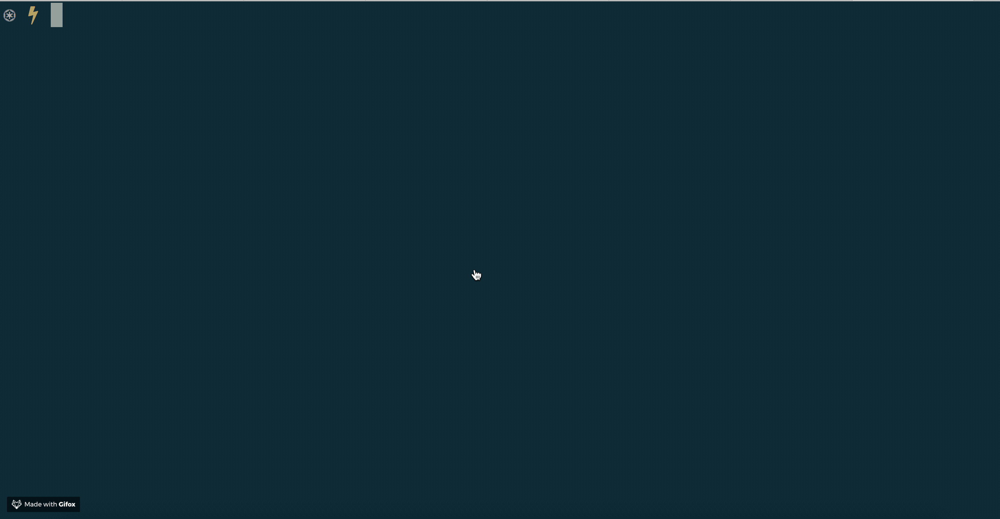
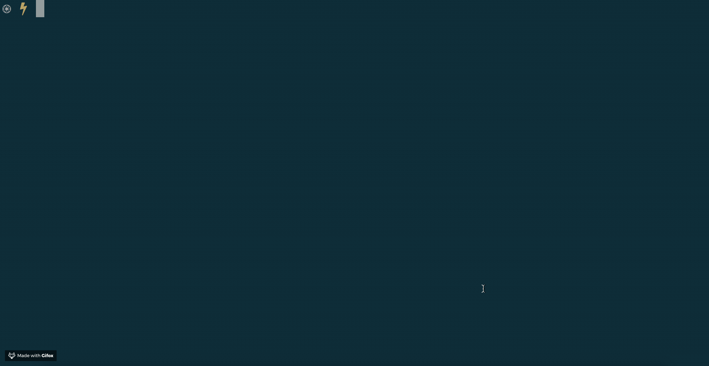
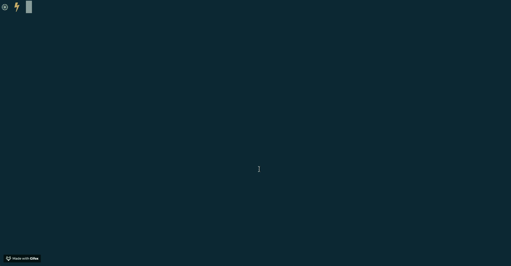
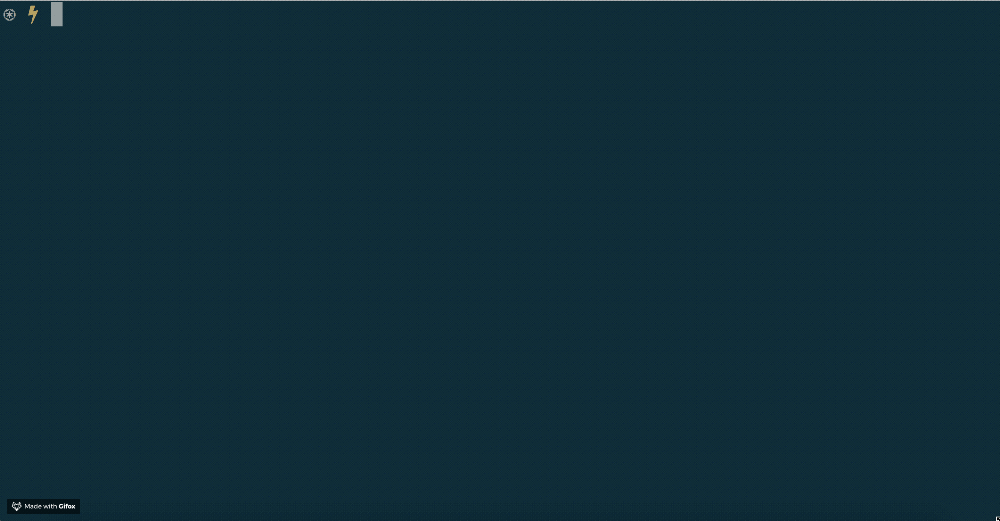

# terminal-printer

This module allows you to turn your terminal screen info a canvas where
you can simply print text in all imaginable colors. You can also do
pixel-art and finally create those fancy stuff you always imagined!

## Demo

Here are some exampes of what you might be be able to do with this:

## Structure

This repository is a monorepo. It contains the [main package](packages/terminal-printer) as well as some [other packages](packages) that make use of the printer. (Basically the stuff you can see in the demo above.)
